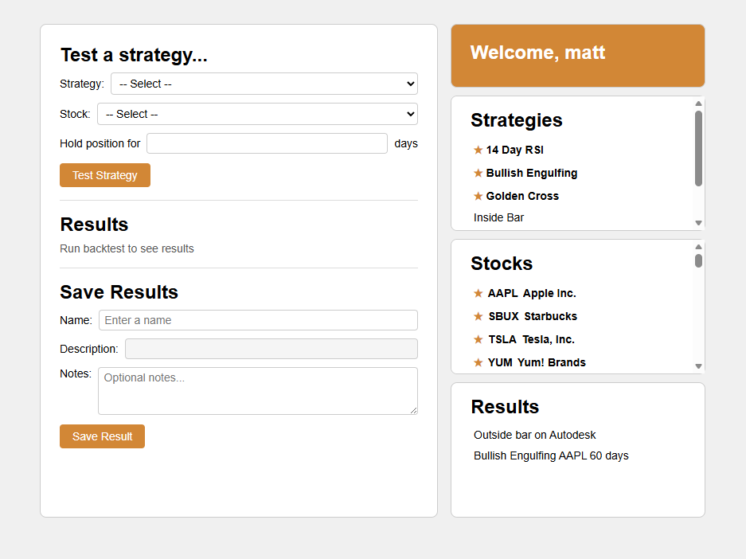

# TradeVault

A full-stack application that automates backtesting of various day trading strategies on S&P 500 stocks. Seeks strategy entry points from over 3,000,000 records of historical market data and compares entry price to price action over the next several days, aggregating results to deliver an accuracy evaluation for each strategy.

## Demo



## Tech Stack

- **Database** — MySQL with stored procedures
- **Backend** — Express.js
- **Data Collection** — Python scripts with Yahoo Finance API
- **Frontend** — JavaScript, HTML, CSS with a custom API wrapper

## Project Structure

```
├── public/
│   ├── dashboard/
│   │   ├── backtesting.js        # Backtesting logic and UI interaction
│   │   ├── dashboard.css         # Dashboard styles
│   │   ├── dashboard.html        # Dashboard page markup
│   │   └── dashboard.js          # Dashboard initialization and state
│   ├── login/
│   │   └── index.html            # Login page
│   ├── api.js                    # Frontend API wrapper for HTTP requests
│   ├── apiDictionary.txt         # API endpoint reference
│   └── test.js                   # Frontend tests
├── Python Scripts/
│   └── loadData.py               # Fetches historical market data via Yahoo Finance
├── db.js                         # MySQL database connection and config
├── procedures.js                 # Stored procedure execution helpers
├── server.js                     # Express.js server entry point
├── package.json
└── package-lock.json
```

## Overview

1. **Data Collection** — Python scripts pull historical price data for S&P 500 stocks via the Yahoo Finance API and load it into MySQL
2. **Strategy Backtesting** — Stored procedures scan millions of records for strategy entry points and evaluate price action over subsequent days
3. **Results Aggregation** — Entry prices are compared against future price movement to calculate accuracy metrics for each strategy
4. **Frontend Dashboard** — Displays backtesting results with a clean interface, powered by a custom API wrapper that simplifies backend communication
